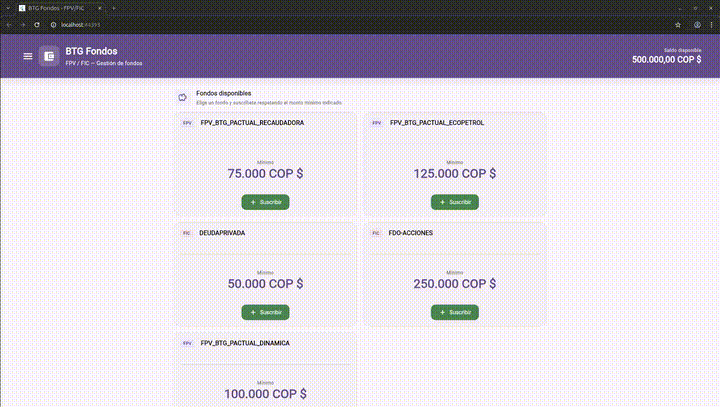

# flutter_application_1

Demo de **BTG Fondos**: app Flutter para explorar **fondos FPV/FIC**, consultar **saldo**, **suscribirse** y **cancelar participaciones** sobre un origen de datos local (mock), con **historial de transacciones** y navegación por **drawer** (`go_router`).

## Requisitos

| Herramienta | Versión |
|-------------|---------|
| **Dart SDK** | `^3.11.0` (ver `pubspec.yaml`) |
| **Flutter** | **3.41.2** (recomendado; el repo incluye [FVM](https://fvm.app/) en `.fvm/`) |

Si usas FVM en la raíz del proyecto:

```bash
fvm use 3.41.2
```

Sin FVM, instala una versión de Flutter compatible con Dart 3.11 (por ejemplo la **stable** actual que cumpla el SDK del `pubspec`).

## Cómo ejecutar

```bash
# Dependencias
fvm flutter pub get    # o: flutter pub get

# Analizar / tests
fvm flutter analyze
fvm flutter test

# App (elige dispositivo o emulador en tu entorno)
fvm flutter run        # o: flutter run

# Web (opcional)
fvm flutter run -d chrome
```

## Estructura (resumen)

- **`lib/`** — capas `domain` / `data` / `core` (tema, router, providers) y feature `funds` (pantallas, widgets).
- **`test/`** — pruebas de widget (`widget_test.dart`, `funds_ui_test.dart`) y helper `test/support/pump_funds_app.dart`.

## Recursos Flutter

- [Documentación Flutter](https://docs.flutter.dev/)
- [Riverpod](https://riverpod.dev/)
- [go_router](https://pub.dev/packages/go_router)

## Evidencias del funcionamiento


